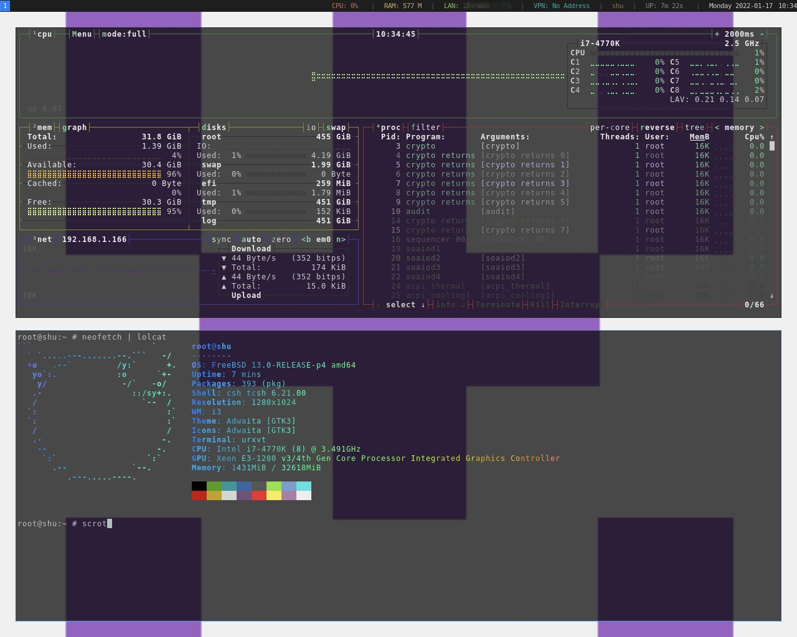
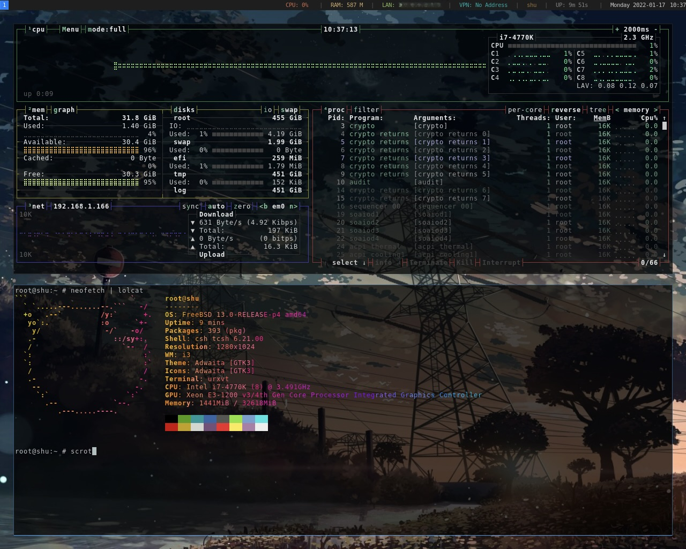
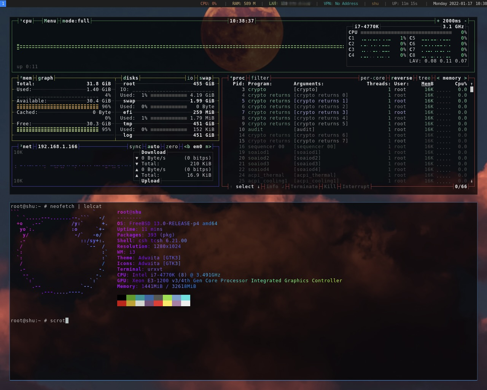
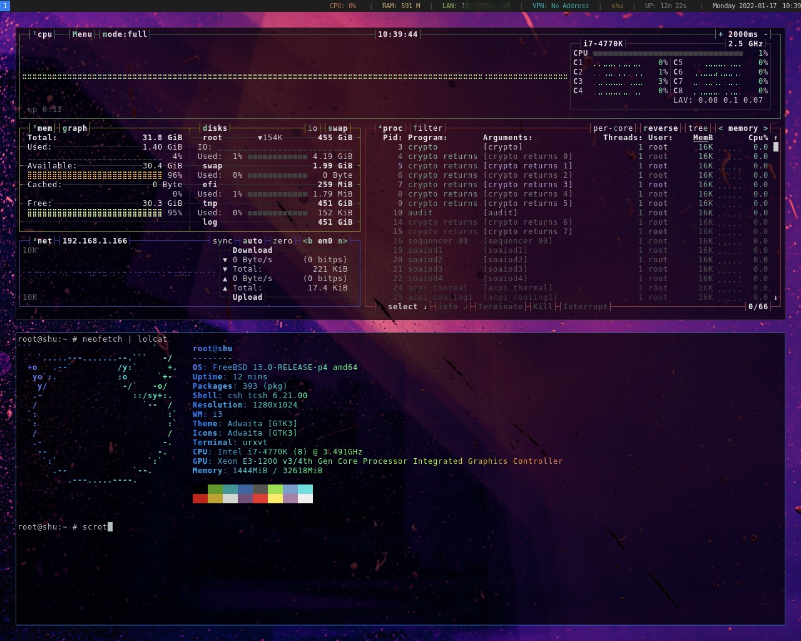

<head>
    
</head>
<body>
    
get excited and make something

</body>

<html lang="en">
  <head>
    <meta charset="utf-8">
    <meta name="viewport" content="width=device-width, initial-scale=1, shrink-to-fit=no">
    <meta name="description" content="">
    <meta name="author" content="Mark Otto, Jacob Thornton, and Bootstrap contributors">
    <meta name="generator" content="Jekyll v4.1.1">
    <title>Album example · Bootstrap</title>

    <link rel="canonical" href="https://getbootstrap.com/docs/4.5/examples/album/">

    <!-- Bootstrap core CSS -->
<link href="../assets/dist/css/bootstrap.min.css" rel="stylesheet">

    
    <!-- Custom styles for this template -->
    <link href="album.css" rel="stylesheet">
  </head>
  <body>
    <header>
  

    

      

        

          <h4 class="text-muted">m1kr0kosmos</h4>
          
Das Lichtmikroskop öffnete das erste Tor zum Mikrokosmos. Das Elektronenmikroskop öffnete das zweite Tor zum Mikrokosmos. Was werden wir finden wenn wir das dritte Tor öffnen? -Ernst Ruska.

        

        

          <h4 class="text-white">Contact</h4>
          <ul class="list-unstyled">
            <li><a href="https://www.instagram.com/boos_cl0.os/" class="text-muted">Instagram</a></li>
            <li><a href="#https://www.facebook.com/will.boos.94" class="text-muted">Facebook</a></li>
            <li><a href="https://www.linkedin.com/in/will-boos-3aa026207/" class="text-muted">LinkedIn</a></li>
          </ul>
        

      

    

  

<main role="main">

  <section class="jumbotron text-center">
    

     
      

        <a href="https://github.com/m1kr0kosmos" class="btn btn-primary my-2">GitHub</a>
        <a href="https://www.youtube.com/channel/UCTVgPeAsPkx68zEzbdpMnEg" class="btn-sm btn-outline-secondary my-2">  YouTube</a>
      

        <h1>AI21 Jurassic 1</h1>
      
I was given permission to document, render, and publish beta-testing. Brand new territory. 

      

          
<iframe width="560" height="315" src="https://www.youtube.com/embed/3I5qr1ej1Xs" frameborder="0" allow="autoplay; encrypted-media" allowfullscreen></iframe>

      
          
<iframe width="560" height="315" src="https://www.youtube.com/embed/RD0a7BCXgOQ" frameborder="0" allow="autoplay; encrypted-media" allowfullscreen></iframe>
      
<h1>Quad Boot</h1>
      
Moving boot partitions around to gain access to four Operating Systems.

      

          
<iframe width="560" height="315" src="https://www.youtube.com/embed/X3cLAE7X10Q" frameborder="0" allow="autoplay; encrypted-media" allowfullscreen></iframe> 
      
<h1>FreeBSD Ricing</h1>
      
wiping, formatting, flashing, partitioning, installing Xauthority, graphics, config files,window manager, and ricing

      

      
<iframe width="560" height="315" src="https://www.youtube.com/embed/F79bFRoAGpg" frameborder="0" allow="autoplay; encrypted-media" allowfullscreen></iframe> 
      
  

    

      <a href="#" class="navbar-brand d-flex align-items-center">
        <svg xmlns="https://www.youtube.com/channel/UCTVgPeAsPkx68zEzbdpMnEg" width="20" height="20" fill="none" stroke="currentColor" stroke-linecap="round" stroke-linejoin="round" stroke-width="2" aria-hidden="true" class="mr-2" viewBox="0 0 24 24" focusable="false"><path d="M23 19a2 2 0 0 1-2 2H3a2 2 0 0 1-2-2V8a2 2 0 0 1 2-2h4l2-3h6l2 3h4a2 2 0 0 1 2 2z"/><circle cx="12" cy="13" r="4"/></svg>
        <strong></strong>
      </a>
      <button class="navbar-toggler" type="button" data-toggle="collapse" data-target="#navbarHeader" aria-controls="navbarHeader" aria-expanded="false" aria-label="Toggle navigation">
        
      </button>
    

  

<footer class="text-muted">
  

    

      <a href="#">Back to top</a>
    

  

</footer>

      

          <!DOCTYPE html>
<html>
<head>
    <title>Bootstrap Carousel</title>
    <link rel="stylesheet" href="//netdna.bootstrapcdn.com/bootstrap/3.1.1/css/bootstrap.min.css">
    
    
</head>
<body>

<h1>Bootstrap Carousel demo</h1>
<!--The main div for carousel-->

  <!-- Sliding images statring here --> 
   
 
    
 
       
    
 
    
 
       
   
 
    
 
       
    

    
 
       
    
 
     
  
 
  <!-- Next / Previous controls here -->
  <a class="left carousel-control" href="#carousel-demo" data-slide="prev">
    
  </a>
  <a class="right carousel-control" href="#carousel-demo" data-slide="next">
    
  </a>
 
  

 

</body>
</html>
